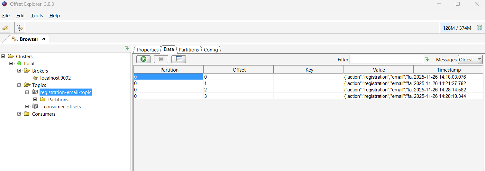
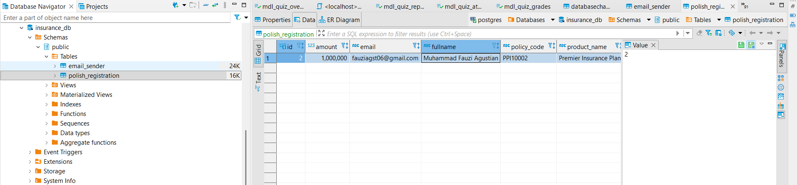
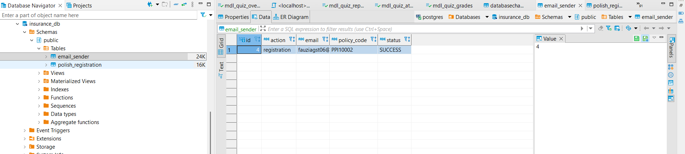
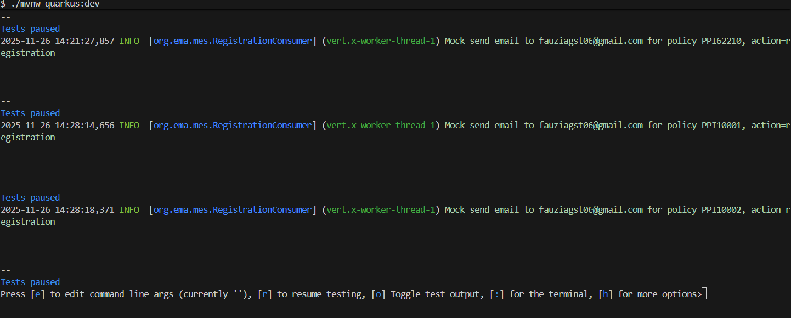

# Insurance Microservices (Quarkus + Kafka + PostgreSQL)

Project ini adalah contoh simple microservices untuk domain asuransi:

- **registration-service**  
  Menerima request pendaftaran polis, menyimpan ke PostgreSQL, generate `policyCode`, lalu mengirim event ke Kafka.
- **email-service**  
  Meng-consume event dari Kafka dan menyimpan log pengiriman email (mock) ke tabel `email_sender`.

Arsitektur (sederhana):

```text
Client
  │
  │  HTTP (REST)
  ▼
registration-service (Quarkus, port 8081)
  │
  │  Kafka topic: registration-email-topic
  ▼
email-service (Quarkus, port 8082)
  │
  ▼
PostgreSQL (tabel: polish_registration, email_sender)


Tech Stack
Java 21
Quarkus 3.x
PostgreSQL 16
Apache Kafka (Confluent image) + Zookeeper
Docker / Docker Desktop
SmallRye Reactive Messaging (Kafka)
Hibernate ORM with Panache


# how to run using docker (PostgreSQL & Kafka)
docker-compose up -d


# Sample Curl for testing 
curl --location 'http://localhost:8081/create-polish' \
--header 'Content-Type: application/json' \
--data-raw '{
  "customerName" : "Muhammad Fauzi Agustian",
  "email":"fauziagst06@gmail.com",
  "productName" : "Premier Insurance Plan",
  "amount": 1000000
}'

# Sample image running project 
run project : 
image-4.png
Kafka monitoring :

Databases postgresql :


Log kafka consumer :
